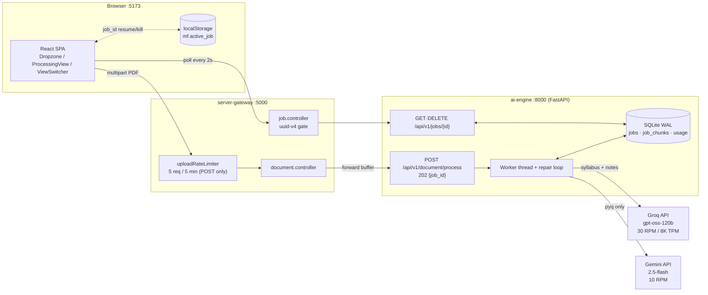
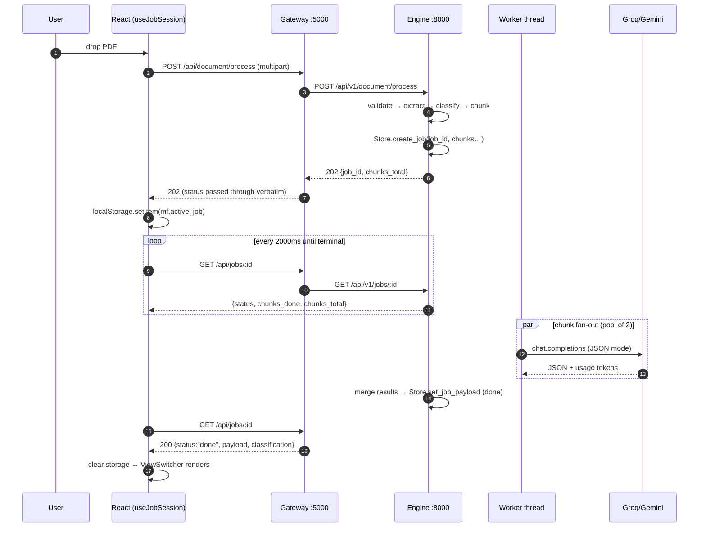
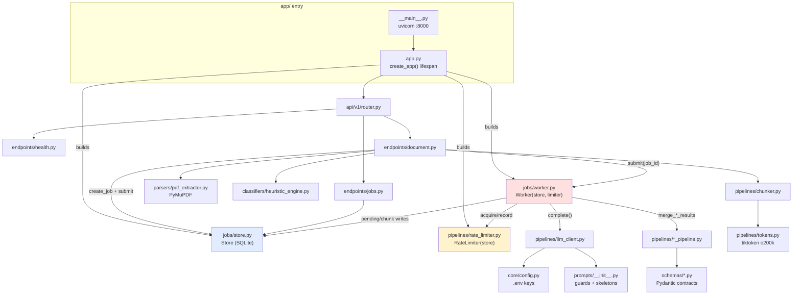
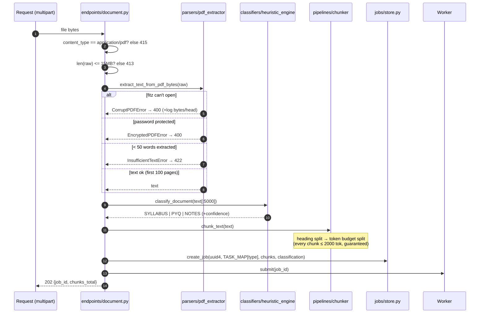
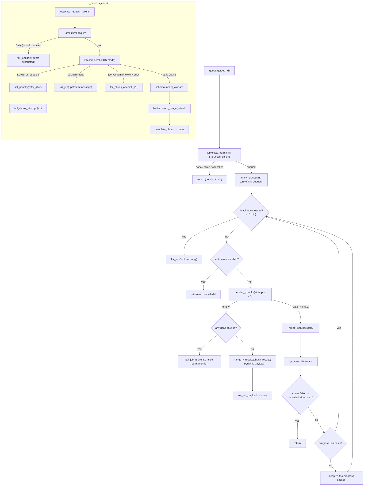
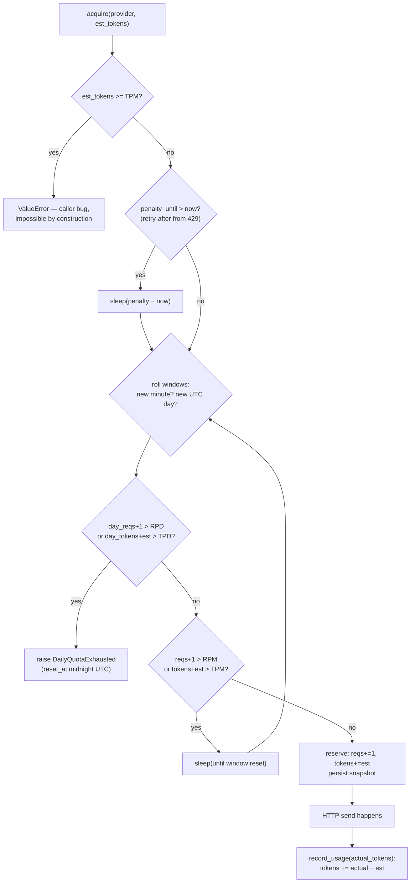
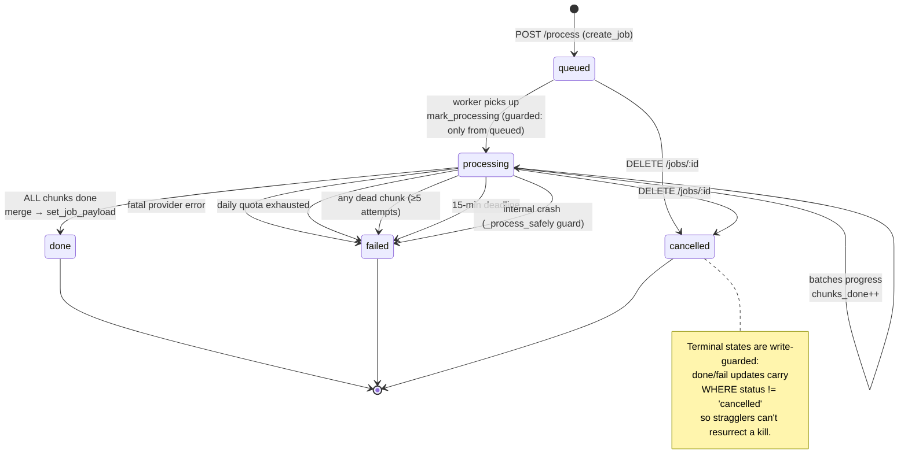
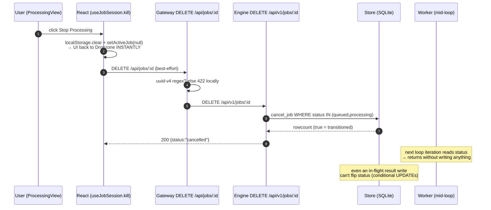

# MindForge AI-Engine — Architecture Diagrams

> Every diagram below mirrors the **actual code** in `ai-engine/app/` (function names, ports,
> error codes). Read each caption for what to notice.
>
> **How to view:** VS Code → install "Markdown Preview Mermaid Support" → open preview
> (`Ctrl+Shift+V`). GitHub/GitLab render these natively.

---

## 1. Overall System — Three Services, One Request Path

**What to notice:** the gateway never touches PDF bytes beyond a 4-byte `%PDF` sniff, and the
*upload* rate limit does not apply to job polling — otherwise 2-second polls would trip it instantly.

---

## 2. Upload Lifecycle — Every HTTP Hop

**What to notice:** the heavy LLM work happens *after* the 202. The client is never blocked;
progress (`chunks_done`) comes from the database, not from guessed timers like the old fake stages.

---

## 3. Engine Folder Map — Who Calls Whom

**What to notice:** `store`, `rate_limiter`, `worker` form the async triangle built once at app
startup. Endpoints are thin — they translate HTTP into calls on those three plus the pure
parse/classify/chunk functions. Nothing talks to an LLM except `llm_client`.

---

## 4. Inside POST /document/process — The Synchronous Half

**What to notice:** this half is *pure local work* — no network beyond the client. That's why the
gateway can afford a 30s timeout again. Every failure here is a specific HTTP code, never a 500.

---

## 5. Worker Repair Loop — Where Reliability Lives

**What to notice:** three exits per chunk — succeed, retry-with-penalty, or die-after-5-attempts.
A dead chunk poisons the whole job *loudly* at the end. Silent blanks are structurally impossible:
`done` requires literally every chunk stored green.

---

## 6. Rate Limiter Decision Flow — The Toll Booth

**What to notice:** counters live in SQLite (`usage` table) — restart the engine mid-day and your
remaining daily quota is still honest. Reservation/reconciliation means bursts don't under-count
or over-count: we reserve the estimate, then true-up with `response.usage`.

---

## 7. Job State Machine

**What to notice:** cancellation is a *first-class terminal state*, not a flavour of failure. The
client treats `failed` and `cancelled` differently — one shows the engine's error, the other just
returns you to the uploader.

---

## 8. Kill Button — Cancellation Across Three Layers

**What to notice:** local-first ordering — the user sees instant feedback regardless of network.
Server-side cancellation is best-effort *for UX* but strict *for correctness*: idempotent DELETE,
guarded writes, worker abort between batches. An in-flight LLM call may finish, but its result
cannot resurrect the job.

---

## Cross-Cutting Invariants (memorise these)

1. **No chunk exceeds 2000 tokens** — force-split fallback closes every path.
2. **Every request fits inside one provider's TPM budget** — input estimate + output reserve.
3. **A job is `done` only when every chunk is `done`** — blanks are impossible by construction.
4. **Terminal states win** — all late writes are conditional on non-terminal status.
5. **Quota truth survives restarts** — counters are persisted, never in-memory-only.
